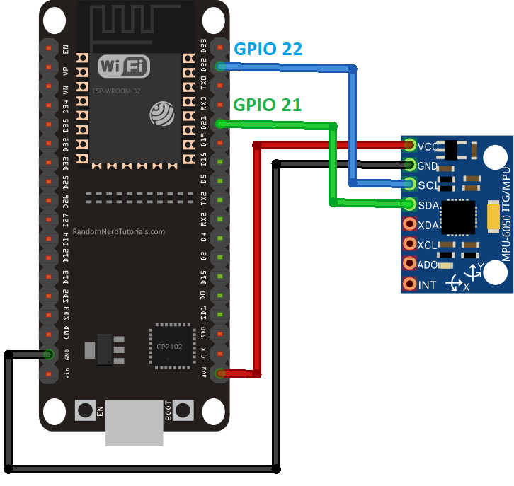

# 2025 10 22 결산

1차적으로 esp32와 arduino IDE를 연결하는 작업을 시도하였음.
esp32 패키지 설치 상황에서 알 수 없는 오류로 인한 2시간 지연을 겪음.
노트북 변경하니 정상 작동.

이후, MPU6050과 연결하는 작업을 진행.
배선도는 다음과 같음.



이후 아래 코드를 통해 테스트를 거침.

```cpp
#include <Wire.h>
#include <MPU6050.h>

MPU6050 mpu;  // 기본 주소 0x68 (AD0 = GND)

void setup() {
  Serial.begin(115200);
  delay(1000);
  Serial.println("MPU6050 rebooting...");

  // I2C 초기화 (ESP32는 핀을 직접 지정해야 함)
  Wire.begin(21, 22);       // SDA=21, SCL=22
  Wire.setClock(400000);    // 400kHz 고속 모드

  mpu.initialize();

  // 연결 테스트
  if (!mpu.testConnection()) {
    Serial.println("❌ MPU6050 connect failed");
    while (1) { delay(1000); }
  }
  Serial.println("✅ MPU6050 connected!");
  delay(1000);
}

void loop() {
  int16_t ax, ay, az;
  int16_t gx, gy, gz;

  // 6축 데이터 읽기
  mpu.getMotion6(&ax, &ay, &az, &gx, &gy, &gz);

  // 출력 (가속도/자이로 원시값)
  Serial.print("Accel (X,Y,Z): ");
  Serial.print(ax); Serial.print(", ");
  Serial.print(ay); Serial.print(", ");
  Serial.print(az);
  Serial.print(" | Gyro (X,Y,Z): ");
  Serial.print(gx); Serial.print(", ");
  Serial.print(gy); Serial.print(", ");
  Serial.println(gz);

  delay(200);  // 5Hz 출력
}
```

아래 사진과 같이 정상 작동하였음.


