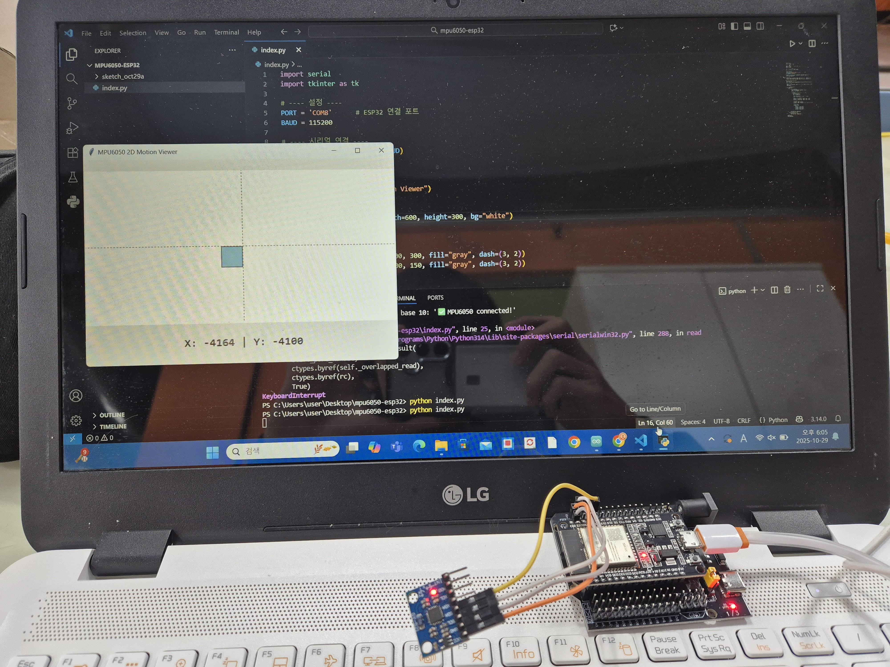

# 2025 10 29 결산

이번에는 mpu6050과 python을 이용해서 gui를 띄워 확인하는 방식으로 테스트하였음.

사용 코드는 아래와 같음.

- mpu6050
- 
```cpp
#include <Wire.h>
#include <MPU6050.h>

MPU6050 mpu;

void setup() {
  Serial.begin(115200);
  delay(1000);
  Serial.println("MPU6050 rebooting...");

  Wire.begin(21, 22);
  Wire.setClock(400000);

  mpu.initialize();

  if (!mpu.testConnection()) {
    Serial.println("❌ MPU6050 connect failed");
    while (1) delay(1000);
  }

  Serial.println("✅ MPU6050 connected!");
  delay(1000);
}

void loop() {
  int16_t ax, ay, az;
  int16_t gx, gy, gz;

  mpu.getMotion6(&ax, &ay, &az, &gx, &gy, &gz);

  // X,Y 가속도만 전송 ("ax,ay" 형식)
  Serial.print(ax);
  Serial.print(",");
  Serial.println(ay);

  delay(50);  // 20Hz
}

```

- python

```python
import serial
import tkinter as tk

# ---- 설정 ----
PORT = 'COM8'      # ESP32 연결 포트
BAUD = 115200

# ---- 시리얼 연결 ----
ser = serial.Serial(PORT, BAUD)

# ---- GUI 설정 ----
root = tk.Tk()
root.title("MPU6050 2D Motion Viewer")
root.geometry("600x400")

canvas = tk.Canvas(root, width=600, height=300, bg="white")
canvas.pack(pady=20)

# 중앙 기준선
canvas.create_line(300, 0, 300, 300, fill="gray", dash=(3, 2))
canvas.create_line(0, 150, 600, 150, fill="gray", dash=(3, 2))

# 네모 (가속도 기반 이동)
box_size = 40
box = canvas.create_rectangle(280, 130, 320, 170, fill="skyblue")

# 현재 값 표시
label = tk.Label(root, text="X: 0 | Y: 0", font=("Consolas", 16))
label.pack()

# ---- 업데이트 함수 ----
def update_box():
    try:
        if ser.in_waiting:
            line = ser.readline().decode().strip()
            parts = line.split(",")
            
            # ESP32에서 "ax,ay" 형식으로 보낼 예정
            if len(parts) == 2:
                ax = int(parts[0])
                ay = int(parts[1])

                label.config(text=f"X: {ax} | Y: {ay}")

                # 값 → 좌표 변환 (감쇠)
                offset_x = max(min(ax / 200.0, 250), -250)
                offset_y = max(min(ay / 200.0, 150), -150)

                # 중앙 기준 좌표
                x_center = 300 + offset_x
                y_center = 150 - offset_y  # 위로 갈수록 값 증가

                # 박스 이동
                canvas.coords(
                    box,
                    x_center - box_size/2,
                    y_center - box_size/2,
                    x_center + box_size/2,
                    y_center + box_size/2
                )

        root.after(20, update_box)
    except Exception as e:
        print("Error:", e)
        root.after(100, update_box)

update_box()
root.mainloop()
```

실행 사진

